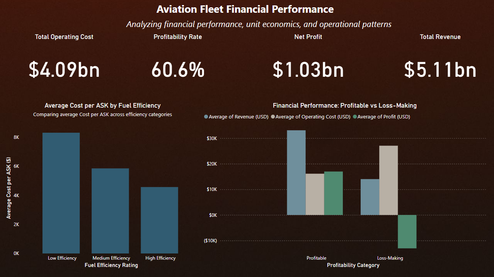
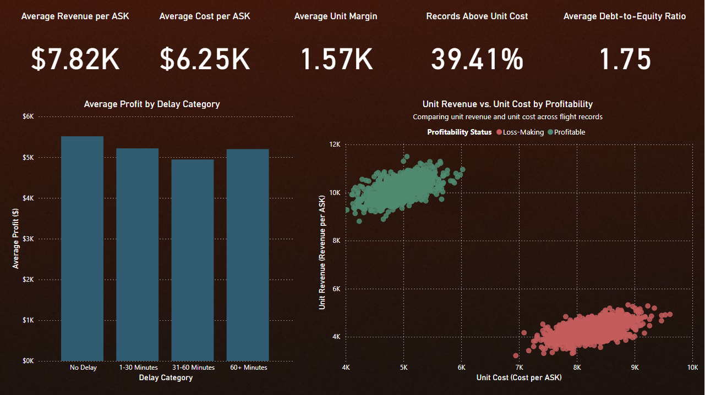

# Aviation Financial Analytics

## Overview

Aviation Financial Analytics is an independent data analytics project focused on evaluating the financial and operational performance of an aviation fleet dataset.

The project combines data preparation, feature engineering, exploratory analysis, financial KPI analysis, SQL analysis, predictive modeling, and Power BI data visualization to examine profitability, unit economics, operating costs, and operational patterns across 200,000 aviation records.

## Objectives

- Analyze financial and operational performance across aviation records
- Calculate financial and profitability KPIs
- Analyze Cost per Available Seat Kilometer (Cost per ASK)
- Examine revenue, operating cost, profit, and cost-to-revenue relationships
- Compare profitable and loss-making records
- Analyze unit economics and records where unit cost exceeds unit revenue
- Examine fuel efficiency and operational variables in relation to unit cost
- Apply machine learning to model Cost per ASK
- Build a Power BI dashboard for financial and operational analysis

## Dataset

The final cleaned dataset contains **200,000 records** and includes financial, operational, aircraft utilization, maintenance, and efficiency-related variables.

Key variables include:

- Flight Number
- Delay (Minutes)
- Aircraft Utilization
- Turnaround Time
- Load Factor
- Fleet Availability
- Maintenance Downtime
- Fuel Efficiency
- Revenue
- Operating Cost
- Net Profit Margin
- Ancillary Revenue
- Debt-to-Equity Ratio
- Revenue per ASK
- Cost per ASK
- Profit

Derived analytical fields include:

- `Cost_to_Revenue_Ratio`
- `Is_Profitable`

## Tools & Technologies

- **Python**
- **Pandas**
- **NumPy**
- **SQL (MySQL)**
- **Scikit-Learn**
- **Power BI**
- **Jupyter Notebook**

## Data Preparation & Analysis

The project involved:

- Preparing and analyzing 200,000 aviation records
- Cleaning and structuring financial and operational variables
- Preparing analytical variables and data types
- Creating profitability and cost-related indicators
- Calculating and analyzing Cost per ASK as a unit-economics metric
- Performing descriptive and statistical analysis
- Examining relationships between financial and operational variables
- Preparing the dataset for SQL analysis and Power BI reporting

## SQL Analysis

A dedicated MySQL analysis script was developed to examine the cleaned aviation dataset.

The SQL workflow includes:

1. Dataset validation
2. Overall financial KPIs
3. Profitability distribution
4. Profitable vs. loss-making financial comparison
5. Highest cost-to-revenue records
6. Largest loss-making records
7. Unit economics
8. Unit-cost vs. unit-revenue analysis
9. Fuel efficiency vs. unit cost
10. Average profit by delay category
11. Flight-level financial performance

The SQL analysis provides a structured financial-analysis layer before visualization in Power BI.

## Predictive Modeling

A **Random Forest Regressor** was developed to model **Cost per ASK** using five operational and efficiency variables:

- Fuel Efficiency
- Load Factor
- Maintenance Downtime
- Aircraft Utilization
- Turnaround Time

### Model Configuration

- Train/test split: **80/20**
- Number of trees: **50**
- Maximum tree depth: **10**
- Predictors: **5**

### Model Results

| Metric | Result |
| --- | ---: |
| R² | 0.1778 |
| MAE | $2,988.29 |

The model showed limited predictive performance, indicating that the selected variables explain only part of the variation in Cost per ASK.

## Feature Importance

The Random Forest model produced the following feature-importance distribution:

| Feature | Importance |
| --- | ---: |
| Fuel Efficiency | 81.8% |
| Load Factor | 5.4% |
| Maintenance Downtime | 4.7% |
| Aircraft Utilization | 4.7% |
| Turnaround Time | 3.5% |

**Fuel Efficiency represented 81.8% of the model's feature importance.**

This is a model-based feature-importance result and should not be interpreted as evidence that fuel efficiency causally explains 81.8% of aviation costs.

## Financial Analysis

The financial analysis examines:

- Total revenue
- Total operating cost
- Total profit
- Profitability distribution
- Cost-to-revenue ratio
- Revenue per ASK
- Cost per ASK
- Unit margin
- Debt-to-equity ratio
- Profitability by delay category
- Fuel-efficiency categories and average Cost per ASK

### Key Results

- **Total Revenue:** approximately **$5.11B**
- **Total Operating Cost:** approximately **$4.09B**
- **Total Profit:** approximately **$1.03B**
- **Profitable Records:** **60.59%**
- **Loss-Making Records:** **39.41%**
- **Records where Cost per ASK exceeds Revenue per ASK:** **39.41%**
- **Average Revenue per ASK:** approximately **$7.82K**
- **Average Cost per ASK:** approximately **$6.25K**
- **Average Unit Margin:** approximately **$1.57K**
- **Average Debt-to-Equity Ratio:** **1.75**

## Power BI Dashboard

A two-page Power BI dashboard was developed to communicate the financial and operational analysis.

### Page 1: Financial Performance

The first page presents:

- Total Operating Cost
- Profitability Rate
- Net Profit
- Total Revenue
- Average Cost per ASK by Fuel Efficiency
- Financial comparison of profitable and loss-making records

### Page 2: Unit Economics & Financial Risk

The second page presents:

- Average Revenue per ASK
- Average Cost per ASK
- Average Unit Margin
- Records Above Unit Cost
- Average Debt-to-Equity Ratio
- Average Profit by Delay Category
- Unit Revenue vs. Unit Cost by Profitability

## Dashboard Screenshots

### Dashboard View 1



### Dashboard View 2



The original Power BI report and exported PDF are available in the `dashboard` folder.

## Repository Structure

```text
Aviation-Financial-Analytics/
│
├── dashboard/
│   ├── airlinepbi.pbix
│   ├── airlinepdf.pdf
│   ├── dashboard1.jpg
│   └── dashboard2.jpg
│
├── data/
│   ├── Aviation_Financial_Cleaned.csv
│   └── Aviation_KPIs_Dataset.csv
│
├── notebooks/
│   ├── airlinedata_cleaned.ipynb
│   ├── airlinedata_statipynb.ipynb
│   └── airlinedata_ML.ipynb
│
├── sql/
│   └── aviation_financial_analysis.sql
│
└── README.md
