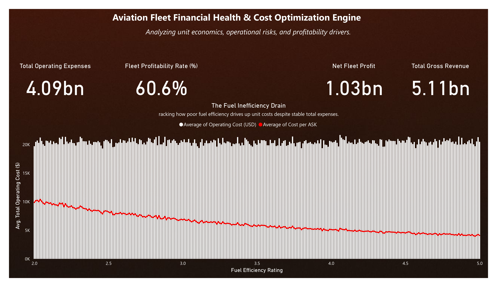
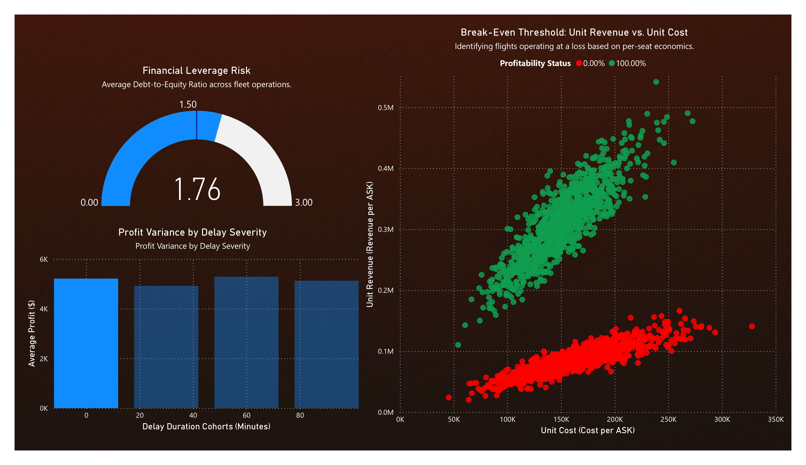

# Aviation Financial Analytics

## Overview

Aviation Financial Analytics is an independent data analytics project focused on analyzing the financial and operational performance of an aviation fleet dataset.

The project combines data cleaning, feature engineering, exploratory analysis, financial KPI analysis, predictive modeling, and Power BI reporting to examine profitability, operating efficiency, and cost behavior across aviation records.

## Objectives

- Analyze financial and operational performance across aviation records
- Calculate profitability and cost-related KPIs
- Examine Cost per Available Seat Kilometer (Cost per ASK)
- Identify patterns in operational and financial metrics
- Apply machine learning to estimate Cost per ASK
- Build an interactive Power BI dashboard for financial and operational reporting

## Dataset

The cleaned dataset contains **200,000 records** and includes financial, operational, aircraft, and efficiency-related variables.

Key variables used in the analysis include:

- Revenue
- Operating Cost
- Profit
- Fuel Efficiency
- Load Factor
- Aircraft Utilization
- Maintenance Downtime
- Turnaround Time
- Available Seat Kilometers (ASK)

The project also derives additional analytical fields, including:

- `Cost_to_Revenue_Ratio`
- `Is_Profitable`
- Cost per ASK

## Tools & Technologies

- **Python**
- **Pandas**
- **NumPy**
- **Scikit-Learn**
- **Power BI**
- **Jupyter Notebook**

## Data Preparation & Analysis

The project involved:

- Cleaning and preparing 200,000 aviation records
- Preparing analytical variables and data types
- Creating profitability and cost-related indicators
- Calculating Cost per ASK as an operational unit-economics metric
- Performing descriptive and statistical analysis
- Examining relationships between operational and financial variables
- Preparing data for Power BI reporting

## Predictive Modeling

A **Random Forest Regressor** was developed to estimate Cost per ASK.

### Model Configuration

- Train/test split: **80/20**
- Number of trees: **50**
- Maximum tree depth: **10**
- Predictors: 5 operational and efficiency variables

### Model Results

| Metric | Result |
|---|---:|
| R² | 0.1778 |
| MAE | $2,988.29 |

The model provides limited predictive performance, indicating that the selected variables explain only part of the variation in Cost per ASK.

## Feature Importance

The Random Forest model identified the following feature-importance distribution:

| Feature | Importance |
|---|---:|
| Fuel Efficiency | 81.8% |
| Load Factor | 5.4% |
| Maintenance Downtime | 4.7% |
| Aircraft Utilization | 4.7% |
| Turnaround Time | 3.5% |

**Fuel Efficiency represented 81.8% of the model's feature importance.**

This is a model-based feature-importance result and should not be interpreted as evidence that fuel efficiency causally explains 81.8% of aviation costs.

## Financial Analysis

The analysis included profitability and cost metrics across the dataset.

The records contain approximately **$1.03 billion in total profit** across the analyzed dataset.

The project also examines:

- Revenue and operating costs
- Profitability
- Cost-to-revenue ratio
- Cost per ASK
- Operational efficiency indicators

## Power BI Dashboard

An interactive Power BI dashboard was developed to provide:

- Financial and operational KPIs
- Profitability analysis
- Cost analysis
- Operational performance
- Aircraft and fleet-level comparisons
- Interactive filtering and visual exploration

## Dashboard Screenshots

The main Power BI dashboard views are shown below.

### Dashboard View 1



### Dashboard View 2



The original Power BI report and exported PDF are also available in the `dashboard` folder.

## Repository Structure

```text
Aviation-Financial-Analytics/
│
├── dashboard/
│   ├── airlinepbi.pbix
│   ├── airlinepbi.pdf
│   ├── dashboard_1.jpg
│   └── dashboard_2.jpg
│
├── data/
│   └── aviation dataset
│
├── notebooks/
│   ├── airlinedata_cleaned.ipynb
│   ├── airlinedata_stat.ipynb
│   └── airlinedata_ML.ipynb
│
└── README.md
```

## Key Takeaways

- The dataset contains 200,000 aviation records with financial and operational information.
- Cost per ASK provides a useful unit-economics perspective for analyzing aviation operating costs.
- Fuel Efficiency had the highest feature importance in the Random Forest model at 81.8%.
- The predictive model achieved an R² of 0.1778, indicating limited explanatory power from the selected predictors.
- The Power BI dashboard provides an interactive way to explore financial and operational performance.

## Key Skills Demonstrated

- Data Cleaning
- Feature Engineering
- Exploratory Data Analysis
- Financial Analysis
- KPI Analysis
- Unit Economics
- Power BI
- Data Visualization
- Predictive Modeling
- Random Forest Regression
- Python
- Pandas
- NumPy
- Scikit-Learn

## Project Type

**Independent Data Analytics Project**

## Author

**Ashindh Anil**
